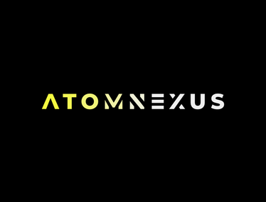

<!-- PROJECT LOGO -->
 

  

  <h3 align="center">ATOMNEXUS</h3>

  

    Good software, easy life.
  

<!-- TABLE OF CONTENTS -->

  
Table of Contents

  <ol>
    <li>
      <a href="#about-the-project">About The Project</a>
      <ul>
        <li><a href="#built-with">Built With</a></li>
      </ul>
    </li>
    <li>
      <a href="#getting-started">Getting Started</a>
      <ul>
        <li><a href="#prerequisites">Prerequisites</a></li>
        <li><a href="#installation">Installation</a></li>
      </ul>
    </li>
    <li><a href="#usage">Usage</a></li>
    <li><a href="#roadmap">Roadmap</a></li>
    <li><a href="#contributing">Contributing</a></li>
    <li><a href="#license">License</a></li>
    <li><a href="#contact">Contact</a></li>
    <li><a href="#acknowledgments">Acknowledgments</a></li>
  </ol>

<!-- ABOUT THE PROJECT -->
## About The Project

Aques projecte recull tots els procéssos de creació d'un software: anàlisi de requisits, disseny i implementació. Concretament es tracta d'una aplicació per una empresa de nutrició.

(<a href="#top">back to top</a>)

### Built With
S'ha utilitzat python3 per la implementació, juntament amb algunes llibreries gràfiques com TKINTER. La part de la BBDD sha implementat amb arxius csv manipulats amb la llibreria Pandas.

(<a href="#top">back to top</a>)

<!-- USAGE EXAMPLES -->
### Usage
Per executar el codi es pot executar l'arxiu main.py que funciona com a test de les funcionalitats de l'aplicació. D'altra banda per executar les interfícies es poden executar els arxius corresponents a cadascuna de les interfícies independentment.

(<a href="#top">back to top</a>)

<!-- ROADMAP -->
### Roadmap
La informació de com s'ha organitzat l'equip es troba a l'arxiu scrum_organization.txt  

(<a href="#top">back to top</a>)

<!-- CONTRIBUTING -->
### Contributing

• Scrum Master: Mateo Sesma - 1568353.

• Product Owner 1: Mateu Serra – 1522956

• Product Owner 2: Gerard Jover – 1527033

• Scrum Team:
Mateu Serra – 1522956, Marc Sedó – 1564815, Gerard Gallardo – 1563397, Oriol Prat – 1565096, Oleguer Gregori – 1566780, Daniel Paulí – 1568073, Gerard Jover – 1527033

(<a href="#top">back to top</a>)

